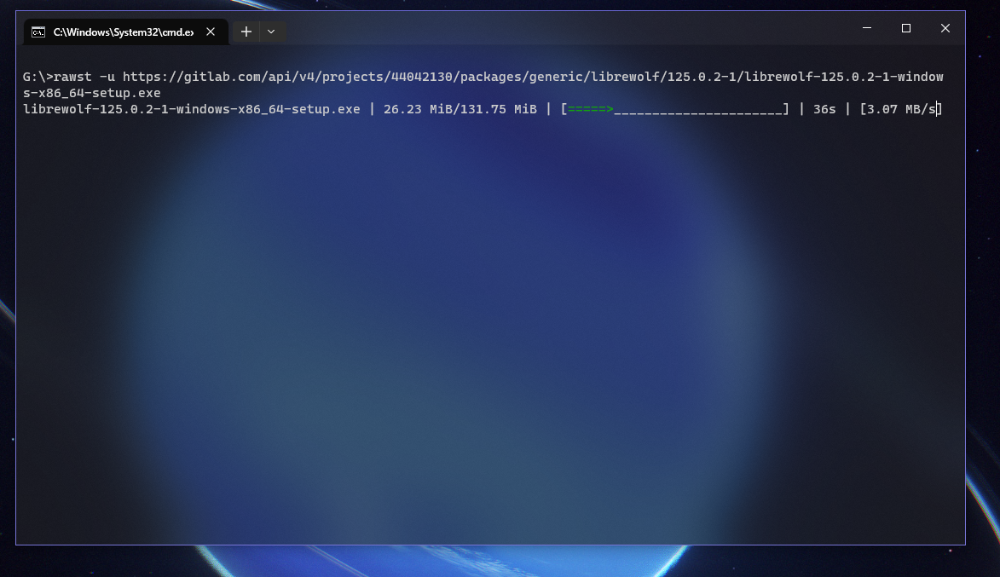
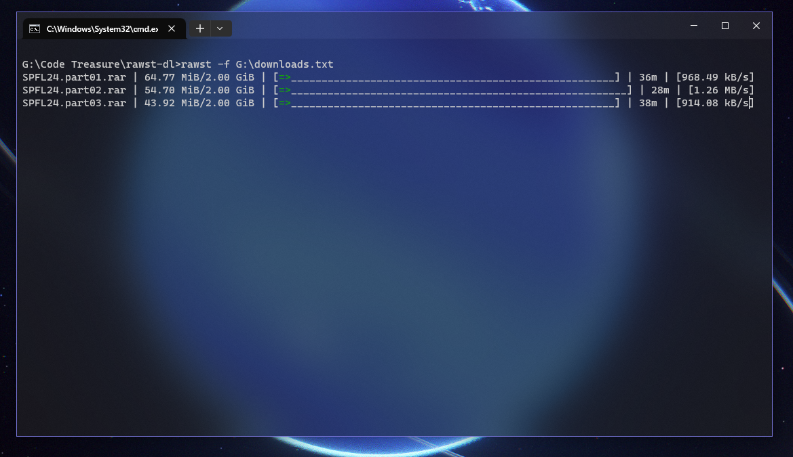

<h1 align="center">Rawst Download Manger</h1>

[](https://github.com/jupiee/rawst/releases) [](https://github.com/jupiee/rawst/blob/master/LICENSE) [](https://github.com/jupiee/rawst)

> **Content**
> - [About](https://github.com/jupiee/rawst#about)
> - [How to install Rawst](https://github.com/jupiee/rawst#how-to-install-rawst)
> - [Usage](https://github.com/jupiee/rawst#usage)
> - [Screenshots](https://github.com/jupiee/rawst#screenshots)
> - [Planned features](https://github.com/jupiee/rawst#planned-features)

### **About**
Snag your files efficiently with Rawst downloader, written in rust for blazingly fast execution. It's lightweight with less dependencies

### 💡 **Features**
- Sequential streamed downloads
- Concurrent downloads with multiple segments
- Multiple file downloads from a text file
- Detailed progress bars
- Blazingly fast execution time
- Lightweight with less dependencies

### 📦 **How to install Rawst?**
<details>
    <summary>Linux</summary>

- Download [Linux installer](https://github.com/Jupiee/rawst/releases/download/0.1/linux.sh) from releases and run it

</details>

<details>
    <summary>Windows</summary>

- Download [Windows installer](https://github.com/Jupiee/rawst/releases/download/0.1/windows.bat) from releases and run it

</details>

<details>
    <summary>Build from source</summary>

- run ``cargo build --release``
- move the binary to corresponding directories
  Windows => ``C:\Users\%USERNAME%\AppData\Local\Microsoft\WindowsApps``
  Linux => ``/usr/local/bin``

</details>

### ⚙️ **Usage**
```
Usage: rawst [OPTIONS]

Options:
  -u, --url <Url>              Url to download
  -f, --file <InputFile>       Filepath to the file with links
  -s, --save-as <Saveas>       Save file as custom name
  -m, --max-threads <Threads>  Maximum number of concurrent downloads [default: 1]
  -h, --help                   Print help
  -V, --version                Print version
```

### **Screenshots**



### 🎯 **Planned features**
* [ ] Torrent support
* [ ] Proxy support
* [ ] Scheduled downloads
* [ ] Custom headers support
* [ ] Resumable downloads
* [ ] Parallel downloads using cores
* [ ] Config files
* [ ] Website link grabber
* [ ] GUI wrapper with [Iced](https://iced.rs/)
* [ ] Rewrite with better design

### **License**
[GNU General Public License v3.0](LICENSE)